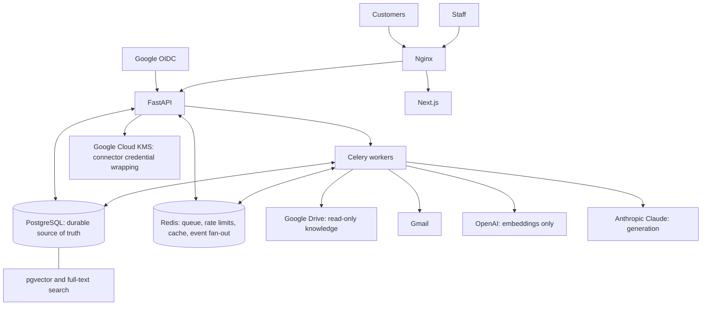
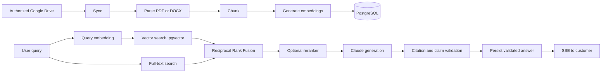

# Enterprise AI Agent Platform

Executable baseline for an enterprise customer-support and knowledge platform built
with FastAPI and Next.js.

## Project Overview

Enterprise AI Agent Platform is a modular monolith with separate background worker
processes, not a microservices architecture. FastAPI provides the backend API and
Next.js provides the public and staff interfaces. PostgreSQL is the durable source
of truth; pgvector and PostgreSQL full-text search provide retrieval; Redis provides
queueing, rate limiting, caching, and ephemeral event fan-out.

The platform ingests administrator-authorized Google Drive knowledge, supports
public customer chat and staff handoff, and provides Gmail triage, knowledge-grounded
drafting, review, and controlled delivery workflows. OpenAI
`text-embedding-3-small` is used only for embeddings. Anthropic Claude is the
generation provider. Google OIDC authenticates staff members.

## Key Features

### Knowledge ingestion

- Administrator-authorized, read-only Google Drive sources.
- PDF and DOCX parsing, deterministic structural chunking, and embedding generation.
- Versioned documents with a retrievable lifecycle and current-version publication.
- Durable synchronization, parsing, and indexing jobs with lease-based recovery.

### Retrieval-augmented generation

- OpenAI `text-embedding-3-small` embeddings with PostgreSQL pgvector search.
- PostgreSQL full-text search running independently alongside vector search.
- Authorization filtering before candidate ranking, followed by Reciprocal Rank
  Fusion (RRF).
- An optional reranker boundary that remains disabled unless evaluation proves its
  value.
- Grounded Claude answers, citation mapping, claim-support validation, and
  customer-safe citation projection.

### Public chat and human support

- Anonymous public chat sessions with scoped opaque credentials and Redis-backed
  rate limiting.
- Asynchronous durable answer jobs; validated answers are persisted in PostgreSQL
  before SSE delivery and reconnect recovery.
- A human-support handoff state machine, staff queue, atomic claim, staff reply,
  explicit Resume AI action, and version-conflict protection.

### Gmail workflows

- Gmail ingestion and classification.
- Knowledge-grounded draft generation and immutable draft versions.
- Reviewer approval, approval invalidation on material changes, controlled Gmail
  delivery, reconciliation for uncertain delivery outcomes, and durable auditability.

### Platform controls

- Organization isolation, role/action authorization, and resource-level grants.
- Audit records, idempotent writes, transactional Outbox events, durable jobs, and
  worker leases.
- Retention and erasure handling, signed webhook delivery, and readiness and health
  visibility.

## System Architecture



PostgreSQL holds durable business state, including jobs, leases, Outbox records,
documents, chat messages, email state, and audit records. Redis is deliberately
non-durable infrastructure: loss of Redis must not lose authoritative platform
state.

## RAG Processing Flow



Vector and text retrieval run independently, and both enforce the same
authorization and document-eligibility scope before ranking. RRF combines their
independently ranked candidates. Reranking is optional and normally disabled unless
evaluation demonstrates a meaningful benefit. OpenAI provides embeddings only;
Claude is the generation provider.

## Repository Structure

```text
backend/
  app/
    main.py                 FastAPI application factory and router registration
    core/                   Configuration, database, Celery, logging, telemetry
    modules/
      identity/             Organizations, staff identities, invitations, OIDC sessions
      authorization/        Role, action, and resource authorization
      audit/                Immutable application audit records
      jobs/                 Durable job intents, leases, attempts, and recovery
      idempotency/          Write-key binding and replay
      outbox/               Transactional events and consumer deduplication
      connectors/           Encrypted Google connection records and gateways
      knowledge/            Drive scopes, document lifecycle, parsing, chunking, sync
      rag/                  Embeddings, hybrid retrieval, RRF, generation, validation
      chat/                 Public sessions, messages, answer processing, rate limits, SSE
      support/              Human handoff state machine and staff workflow
      email/                Gmail intake, classification, drafts, review, delivery
      retention/            Retention policy, erasure ledger, deletion execution
      webhooks/             Signed, versioned Outbox webhook delivery
      operations/           Readiness, failure views, and operational summaries
  alembic/
    versions/               Ordered database migrations
  tests/
    unit/                   Pure behavior tests
    integration/            PostgreSQL, pgvector, Redis, and boundary tests
    e2e/                    Cross-module HTTP and worker workflows

frontend/
  app/                      Public chat and authenticated staff routes
  components/               Product components
  lib/                      Typed API, SSE, session, and shared client utilities
  tests/                    Vitest component and integration tests
  e2e/                      Playwright customer and staff journeys

infra/
  nginx/                    Reverse-proxy, TLS, and SSE buffering configuration

scripts/                    Operational verification, backup, recovery, and evaluation commands

docs/
  architecture/             Runtime, state-machine, and security-boundary documentation
  api/                      Generated OpenAPI contract and usage notes
  deployment/               Production deployment and credential ownership guidance
  operations/               Capacity, incident, and operational guidance
  runbooks/                 Subsystem operating procedures
  readiness/                Readiness checklist and delivery gates
  handoff/                  Asset, training, and acceptance handoff records
  evidence/                 Committed verification evidence indexes
```

## Technology Stack

| Area | Technologies |
| --- | --- |
| Backend | Python 3.12, FastAPI, Pydantic 2, SQLAlchemy 2 async, Alembic, Celery |
| Data | PostgreSQL, pgvector, Redis |
| AI | Anthropic Claude for generation; OpenAI `text-embedding-3-small` for embeddings |
| Google | Google Drive API, Gmail API, Google OIDC, Google Cloud KMS |
| Frontend | Next.js, React, TypeScript, Tailwind CSS |
| Testing and operations | pytest, Vitest, Playwright, Ruff, mypy, Docker Compose, Nginx, Prometheus, Grafana, Loki |

## Security and Reliability

The platform enforces organization isolation, role/action checks, and resource-level
authorization. Connector credentials are envelope-encrypted; Drive access is
read-only. Idempotent writes, transactional Outbox records, durable PostgreSQL job
state, and worker leases make asynchronous work recoverable. Customer-facing errors
are safe, and output is validated before customer delivery. The repository contains
no customer credentials or secrets.

For detailed boundaries and operating guidance, see the
[security boundaries](docs/architecture/security-boundaries.md),
[state machines](docs/architecture/state-machines.md), and
[incident-response guidance](docs/operations/incident-response.md).

## Quick Start

Requirements: Python 3.12 or 3.13, Node.js 20.9+, and Docker Compose.

```bash
cp .env.example .env
make install
make test
make lint
make typecheck
```

The environment example contains empty placeholders only. Supply customer-owned
credentials through the environment; do not commit `.env`.

Run the container baseline with `docker compose up --build`. The backend exposes
`GET /health/live` on port 8000 and the frontend runs on port 3000. Liveness never
connects to PostgreSQL, Redis, or external APIs.

See [the platform baseline runbook](docs/runbooks/platform-baseline.md) for
operating commands and [the readiness checklist](docs/readiness/checklist.md) for
the explicit not-ready delivery gates.

## Documentation and Production Handoff

The runnable production package is documented in the
[deployment procedure](docs/deployment/production.md),
[generated API contract](docs/api/README.md),
[architecture overview](docs/architecture/overview.md),
[runbooks](docs/runbooks/),
[readiness checklist](docs/readiness/checklist.md),
[asset register](docs/handoff/asset-register.md), and
[customer acceptance record](docs/handoff/acceptance.md).

Run `scripts/export-openapi --output docs/api/openapi.json` and
`scripts/check-documentation` after API or operational-document changes.

The repository never includes customer credentials. Production readiness remains a
customer-owned decision after the documented asset transfer, credential rotation,
developer-access removal, recovery evidence, and acceptance gates are complete.
